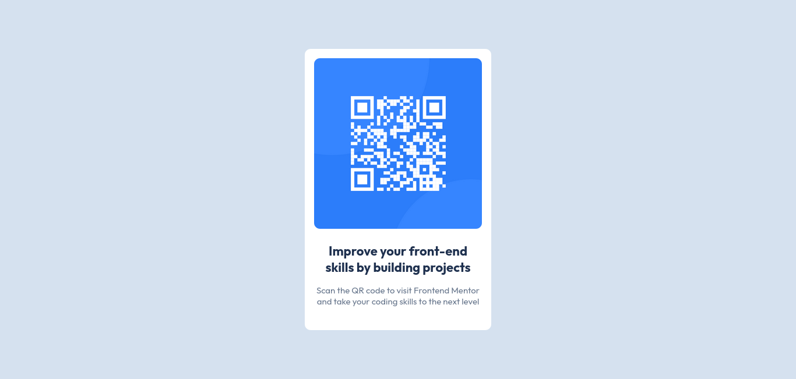

# Frontend Mentor - QR code component solution

This is a solution to the [QR code component challenge on Frontend Mentor](https://www.frontendmentor.io/challenges/qr-code-component-iux_sIO_H). Frontend Mentor challenges help you improve your coding skills by building realistic projects.

## Table of contents

- [Overview](#overview)
  - [Screenshot](#screenshot)
- [My process](#my-process)
  - [Built with](#built-with)
  - [What I learned](#what-i-learned)
  - [Continued development](#continued-development)
  - [Useful resources](#useful-resources)
- [Author](#author)
- [Acknowledgments](#acknowledgments)

## Overview

Repository contains a qr code when scanned redirects to frontendmentor.io

### Screenshot



## My process

### Built with

- Semantic HTML5 markup
- CSS custom properties
- Flexbox

### What I learned

During this project, I deepened my understanding of using Flexbox for layout structuring. Flexbox allowed me to easily center elements within the webpage by leveraging properties like justify-content and align-items. This made aligning content more efficient compared to older techniques like using margins or positioning. With Flexbox, I could quickly align my elements horizontally and vertically, creating a more responsive and visually balanced design.

Additionally, I gained experience working with IDs and Class selectors in CSS. I learned how to target specific elements using their unique ID attributes, like #title and #paragraph, to apply distinct styles for text formatting and spacing. This was useful in cases where I needed to apply styles to one particular element, while class selectors were effective for reusable styles across multiple elements.

These concepts helped streamline my approach to both layout and styling, making the overall design process more intuitive and structured.

```html
<div>
  <h1 id="title">Improve your front-end skills by building projects</h1>
  <p id="paragraph">
    Scan the QR code to visit Frontend Mentor and take your coding skills to the
    next level
  </p>
</div>
```

```css
body {
  width: 100vw;
  height: 100vh;
  background-color: #d5e1ef;
  display: flex;
  justify-content: center;
  align-items: center;
}

#title {
  font-family: outfit;
  font-size: 22px;
  color: #1f314f;
  margin-top: 24px;
}

#paragraph {
  font-family: outfit;
  font-size: 15px;
  color: #68778d;
  margin-top: 16px;
  margin-bottom: 24px;
}
```

If you want more help with writing markdown, we'd recommend checking out [The Markdown Guide](https://www.markdownguide.org/) to learn more.

**Note: Delete this note and the content within this section and replace with your own learnings.**

### Continued development

Use this section to outline areas that you want to continue focusing on in future projects. These could be concepts you're still not completely comfortable with or techniques you found useful that you want to refine and perfect.

**Note: Delete this note and the content within this section and replace with your own plans for continued development.**

### Useful resources

- [Example resource 1](https://www.example.com) - This helped me for XYZ reason. I really liked this pattern and will use it going forward.
- [Example resource 2](https://www.example.com) - This is an amazing article which helped me finally understand XYZ. I'd recommend it to anyone still learning this concept.

**Note: Delete this note and replace the list above with resources that helped you during the challenge. These could come in handy for anyone viewing your solution or for yourself when you look back on this project in the future.**

## Author

- Website - [Add your name here](https://www.your-site.com)
- Frontend Mentor - [@yourusername](https://www.frontendmentor.io/profile/yourusername)
- Twitter - [@yourusername](https://www.twitter.com/yourusername)

**Note: Delete this note and add/remove/edit lines above based on what links you'd like to share.**

## Acknowledgments

This is where you can give a hat tip to anyone who helped you out on this project. Perhaps you worked in a team or got some inspiration from someone else's solution. This is the perfect place to give them some credit.

**Note: Delete this note and edit this section's content as necessary. If you completed this challenge by yourself, feel free to delete this section entirely.**
